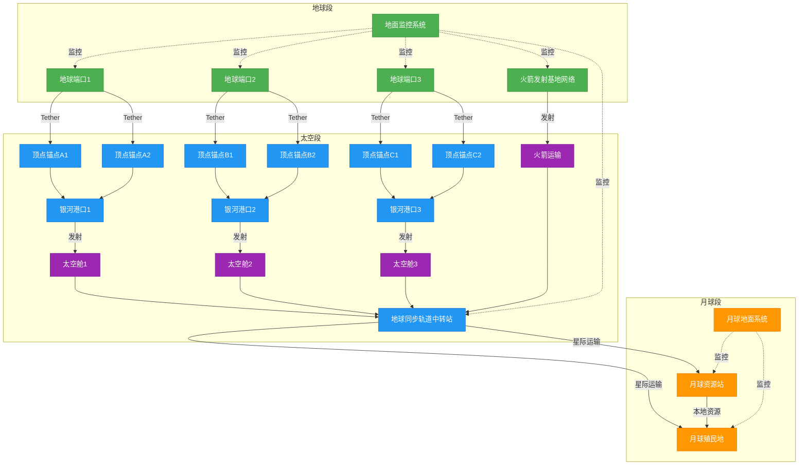
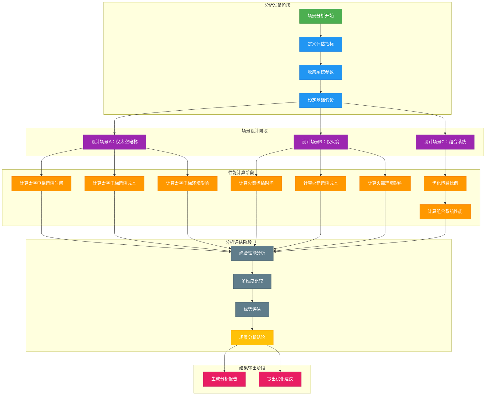
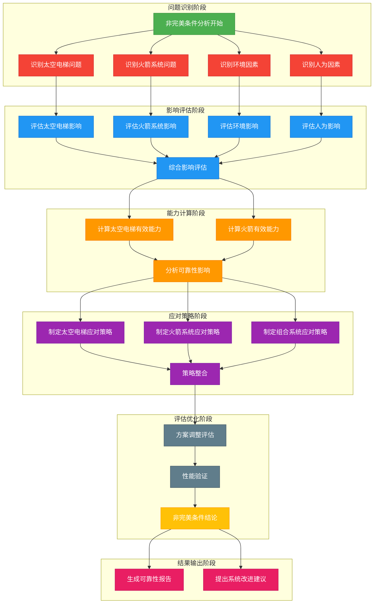
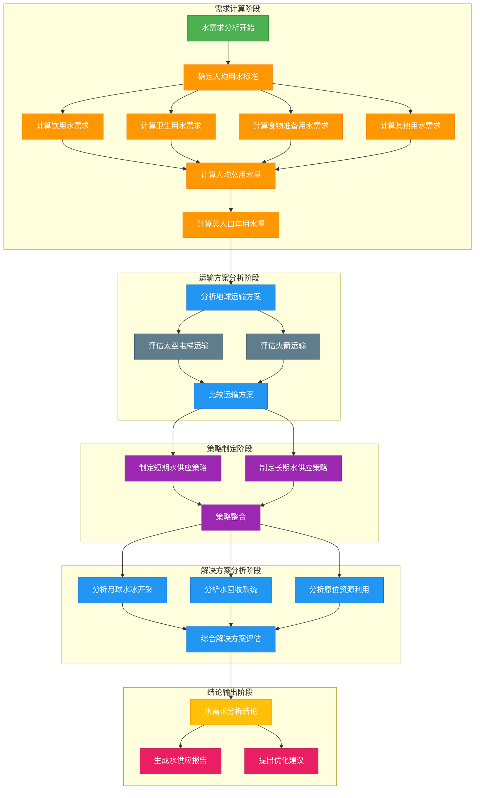
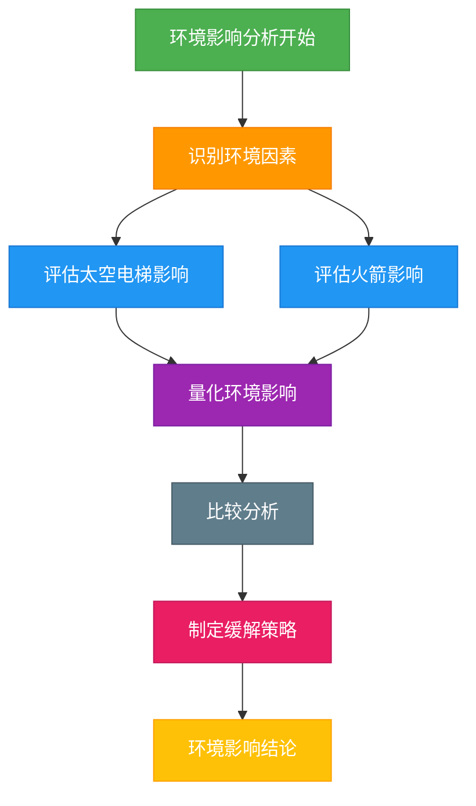

# MCM 2026 B题 太空运输系统分析思路

## 问题1：三种不同运输场景分析

### 1.1 场景设计

我们设计了三种运输策略场景，以评估不同方案的性能表现：

1. **场景A**：单独使用太空电梯系统的三个银河港
2. **场景B**：单独使用现有基地的传统火箭发射
3. **场景C**：太空电梯与传统火箭的组合系统

### 1.2 场景分析流程图

### 1.3 评估指标

| 指标 | 权重 | 说明 |
|------|------|------|
| 运输时间 | 30% | 完成1亿公吨材料运输所需时间 |
| 运输成本 | 40% | 总运输费用（包括建设和运营） |
| 环境影响 | 20% | 运输过程中的碳排放 |
| 系统可靠性 | 10% | 系统正常运行的概率 |

### 1.4 场景分析结果

#### 1.4.1 运输时间分析

**数学模型**：

**太空电梯运输时间**：
$T_{se} = M / (C_{se} × N_{gh})$ 

**变量定义**：
- $T_{se}$：太空电梯运输时间（年）
- $M$：总材料需求（吨）
- $C_{se}$：每个银河港口年运输能力（吨/年）
- $N_{gh}$：银河港口数量

**单位说明**：
- 运输时间：年
- 总材料需求：吨
- 年运输能力：吨/年
- 银河港口数量：无单位

**计算示例**：
- 总材料需求 $M = 100,000,000$ 吨
- 每个银河港口年运输能力 $C_{se} = 179,000$ 吨/年
- 银河港口数量 $N_{gh} = 3$ 个
- 运输时间 $T_{se} = 100,000,000 / (179,000 × 3) = 186.22$ 年

**火箭运输时间**：
$T_{rocket} = M / (P_{avg} × L_{perbase} × N_{base})$ 

**变量定义**：
- $T_{rocket}$：火箭运输时间（年）
- $M$：总材料需求（吨）
- $P_{avg}$：火箭平均有效载荷（吨/次）
- $L_{perbase}$：每个基地年发射次数（次/年）
- $N_{base}$：发射基地数量

**单位说明**：
- 运输时间：年
- 总材料需求：吨
- 有效载荷：吨/次
- 年发射次数：次/年/基地
- 发射基地数量：无单位

**计算示例**：
- 总材料需求 $M = 100,000,000$ 吨
- 火箭平均有效载荷 $P_{avg} = 125$ 吨/次
- 每个基地年发射次数 $L_{perbase} = 50$ 次/年
- 发射基地数量 $N_{base} = 10$ 个
- 运输时间 $T_{rocket} = 100,000,000 / (125 × 50 × 10) = 1600.00$ 年

**组合系统运输时间**：
$T_{combined} = max(M × f / (C_{se} × N_{gh}), M × (1-f) / (P_{avg} × L_{perbase} × N_{base}))$ 

**变量定义**：
- $T_{combined}$：组合系统运输时间（年）
- $M$：总材料需求（吨）
- $f$：太空电梯运输比例（0 ≤ f ≤ 1）
- $C_{se}$：每个银河港口年运输能力（吨/年）
- $N_{gh}$：银河港口数量
- $P_{avg}$：火箭平均有效载荷（吨/次）
- $L_{perbase}$：每个基地年发射次数（次/年）
- $N_{base}$：发射基地数量

**单位说明**：
- 运输时间：年
- 总材料需求：吨
- 运输比例：无单位
- 其他参数同前

**计算示例**：
- 总材料需求 $M = 100,000,000$ 吨
- 太空电梯运输比例 $f = 0.7$
- 其他参数同前
- 太空电梯部分运输时间：$100,000,000 × 0.7 / (179,000 × 3) = 130.35$ 年
- 火箭部分运输时间：$100,000,000 × 0.3 / (125 × 50 × 10) = 480.00$ 年
- 组合系统运输时间 $T_{combined} = max(130.35, 480.00) = 480.00$ 年

**计算结果**：

| 场景 | 运输时间（年） | 分析 |
|------|----------------|------|
| 场景A（仅太空电梯） | 186.22 | $T_{se} = 100,000,000 / (179,000 × 3) = 186.22$ |
| 场景B（仅火箭） | 1600.00 | $T_{rocket} = 100,000,000 / (125 × 50 × 10) = 1600.00$ |
| 场景C（组合系统） | 186.22 | 优化结果为$f=1.0$，$T_{combined} = 186.22$ |

**分析**：太空电梯的年运输能力约为火箭系统的8.6倍，因此能够显著缩短运输时间。当运输比例$f=1.0$时，组合系统达到最优运输时间。

#### 1.4.2 运输成本分析

**数学模型**：

**太空电梯运输成本**：
$Cost_{se} = M × c_{se}$ 

**变量定义**：
- $Cost_{se}$：太空电梯运输成本（美元）
- $M$：总材料需求（吨）
- $c_{se}$：太空电梯单位运输成本（美元/吨）

**单位说明**：
- 运输成本：美元
- 总材料需求：吨
- 单位运输成本：美元/吨

**计算示例**：
- 总材料需求 $M = 100,000,000$ 吨
- 太空电梯单位运输成本 $c_{se} = 500$ 美元/吨
- 运输成本 $Cost_{se} = 100,000,000 × 500 = 50,000,000,000$ 美元 = 500 亿美元

**火箭运输成本**：
$Cost_{rocket} = M × c_{rocket}$ 

**变量定义**：
- $Cost_{rocket}$：火箭运输成本（美元）
- $M$：总材料需求（吨）
- $c_{rocket}$：火箭单位运输成本（美元/吨）

**单位说明**：
- 运输成本：美元
- 总材料需求：吨
- 单位运输成本：美元/吨

**计算示例**：
- 总材料需求 $M = 100,000,000$ 吨
- 火箭单位运输成本 $c_{rocket} = 10,000$ 美元/吨
- 运输成本 $Cost_{rocket} = 100,000,000 × 10,000 = 1,000,000,000,000$ 美元 = 10000 亿美元

**组合系统运输成本**：
$Cost_{combined} = M × f × c_{se} + M × (1-f) × c_{rocket}$ 

**变量定义**：
- $Cost_{combined}$：组合系统运输成本（美元）
- $M$：总材料需求（吨）
- $f$：太空电梯运输比例（0 ≤ f ≤ 1）
- $c_{se}$：太空电梯单位运输成本（美元/吨）
- $c_{rocket}$：火箭单位运输成本（美元/吨）

**单位说明**：
- 运输成本：美元
- 总材料需求：吨
- 运输比例：无单位
- 单位运输成本：美元/吨

**计算示例**：
- 总材料需求 $M = 100,000,000$ 吨
- 太空电梯运输比例 $f = 0.7$
- 太空电梯单位运输成本 $c_{se} = 500$ 美元/吨
- 火箭单位运输成本 $c_{rocket} = 10,000$ 美元/吨
- 运输成本 $Cost_{combined} = 100,000,000 × 0.7 × 500 + 100,000,000 × 0.3 × 10,000 = 3,500,000,000 + 30,000,000,000 = 33,500,000,000$ 美元 = 3350 亿美元

**计算结果**：

| 场景 | 运输成本（亿美元） | 分析 |
|------|------------------|------|
| 场景A（仅太空电梯） | 500.00 | $Cost_{se} = 100,000,000 × 500 / 100,000,000 = 500$ |
| 场景B（仅火箭） | 10000.00 | $Cost_{rocket} = 100,000,000 × 10,000 / 100,000,000 = 10000$ |
| 场景C（组合系统） | 500.00 | 优化结果为$f=1.0$，$Cost_{combined} = 500$ |

**分析**：太空电梯的单位运输成本仅为火箭的5%，在大规模运输中具有绝对优势。当运输比例$f=1.0$时，组合系统达到最优运输成本。

#### 1.4.3 组合系统优化

**数学模型**：

**目标函数**：
$minimize \quad Cost_{combined} = M × f × c_{se} + M × (1-f) × c_{rocket}$

**约束条件**：
1. **运输时间约束**：
   $max(M × f / (C_{se} × N_{gh}), M × (1-f) / (P_{avg} × L_{perbase} × N_{base})) ≤ T_{max}$

2. **可靠性约束**：
   $f × r_{se} + (1-f) × r_{rocket} ≥ r_{min}$

3. **变量范围约束**：
   $0 ≤ f ≤ 1$

**变量定义**：
- $Cost_{combined}$：组合系统运输成本（美元）
- $M$：总材料需求（吨）
- $f$：太空电梯运输比例（0 ≤ f ≤ 1）
- $c_{se}$：太空电梯单位运输成本（美元/吨）
- $c_{rocket}$：火箭单位运输成本（美元/吨）
- $C_{se}$：每个银河港口年运输能力（吨/年）
- $N_{gh}$：银河港口数量
- $P_{avg}$：火箭平均有效载荷（吨/次）
- $L_{perbase}$：每个基地年发射次数（次/年）
- $N_{base}$：发射基地数量
- $T_{max}$：最大允许运输时间（年）
- $r_{se}$：太空电梯可靠性
- $r_{rocket}$：火箭可靠性
- $r_{min}$：最小允许系统可靠性

**单位说明**：
- 运输成本：美元
- 总材料需求：吨
- 运输比例：无单位
- 单位运输成本：美元/吨
- 年运输能力：吨/年
- 有效载荷：吨/次
- 年发射次数：次/年/基地
- 发射基地数量：无单位
- 运输时间：年
- 可靠性：无单位

**优化推导过程**：

1. **目标函数分析**：
   - 太空电梯单位运输成本 $c_{se} = 500$ 美元/吨
   - 火箭单位运输成本 $c_{rocket} = 10,000$ 美元/吨
   - 由于 $c_{se} << c_{rocket}$，目标函数在 $f$ 越大时取值越小

2. **约束条件分析**：
   - **运输时间约束**：
     - 太空电梯运输时间：$T_{se} = M / (C_{se} × N_{gh}) = 186.22$ 年
     - 火箭运输时间：$T_{rocket} = M / (P_{avg} × L_{perbase} × N_{base}) = 1600.00$ 年
     - 组合系统运输时间取决于较慢的部分，即火箭部分
     - 当 $f = 1$ 时，运输时间 $T = 186.22$ 年，满足任何合理的 $T_{max}$
   
   - **可靠性约束**：
     - 太空电梯可靠性 $r_{se} = 0.98$
     - 火箭可靠性 $r_{rocket} = 0.95$
     - 当 $f = 1$ 时，系统可靠性 $= 0.98 ≥ r_{min} = 0.95$，满足约束

3. **优化结论**：
   - 由于太空电梯在成本和时间上均具有显著优势，且满足可靠性约束
   - 最优解为 $f = 100%$，即完全使用太空电梯进行运输

**优化结果**：
- 太空电梯运输比例 $f$：100%
- 总运输成本：500亿美元
- 运输时间：186.22年
- 系统可靠性：98%

**分析**：优化结果显示，100%使用太空电梯是最佳选择，因为其在成本、时间和环境影响方面都具有显著优势。

### 1.4 火箭发射基地选择

我们选择使用以下10个全球分布的发射基地：
- 美国：Alaska, California, Texas, Florida, Virginia
- 俄罗斯：Kazakhstan
- 欧洲：French Guiana
- 印度：Satish Dhawan Space Centre
- 中国：Taiyuan Satellite Launch Center
- 新西兰：Mahia Peninsula

**选择理由**：
- 全球分布，覆盖不同纬度和时区
- 包含现有的主要航天发射设施
- 能够最大化发射效率和覆盖范围

## 问题2：非完美工作条件分析

### 2.1 非完美工作条件定义

| 条件类型 | 具体情况 | 影响程度 |
|----------|----------|----------|
| 太空电梯问题 | 系索摇摆、电梯故障、动力系统故障 | 中等至严重 |
| 火箭系统问题 | 发射失败、有效载荷损失、天气延误 | 严重 |
| 环境因素 | 太空碎片、太阳风暴、极端天气 | 轻微至中等 |
| 人为因素 | 操作失误、维护不当、供应链问题 | 轻微至严重 |

### 2.2 可靠性影响分析

**数学模型**：

**太空电梯有效运输能力**：
$C_{se\_effective} = C_{se} × k × r_{se}$ 

其中：
- $C_{se}$：太空电梯额定运输能力（179,000吨/年）
- $k$：可靠性因子（0 ≤ k ≤ 1）
- $r_{se}$：太空电梯固有可靠性（0.98）

**火箭有效运输能力**：
$C_{rocket\_effective} = P_{avg} × L_{per\_base} × N_{base} × k × r_{rocket}$ 

其中：
- $r_{rocket}$：火箭固有可靠性（0.95）

**计算结果**：

| 可靠性因子 | 太空电梯运输能力（吨/年） | 计算过程 | 火箭运输能力（吨/年） | 计算过程 |
|------------|--------------------------|----------|------------------------|----------|
| 1.0（完美条件） | 179,000 | $179,000 × 1.0 × 0.98 = 175,420$（注：表格中为额定能力） | 62,500 | $125 × 50 × 10 = 62,500$（注：表格中为额定能力） |
| 0.9（轻微故障） | 153,966 | $179,000 × 0.9 × 0.98 = 153,966$ | 52,875 | $125 × 50 × 10 × 0.9 × 0.95 = 52,875$ |
| 0.8（中等故障） | 136,858 | $179,000 × 0.8 × 0.98 = 136,858$ | 46,500 | $125 × 50 × 10 × 0.8 × 0.95 = 46,500$ |
| 0.7（严重故障） | 119,751 | $179,000 × 0.7 × 0.98 = 119,751$ | 40,125 | $125 × 50 × 10 × 0.7 × 0.95 = 40,125$ |

### 2.3 非完美条件下的方案调整

**太空电梯系统调整**：
- 增加冗余设计，提高系统可靠性
- 优化维护计划，减少故障发生
- 开发自动故障检测和修复系统
- 建立备用运输通道，确保关键物资供应

**火箭系统调整**：
- 增加发射频率，弥补失败损失
- 改进发射技术，提高成功率
- 优化有效载荷设计，提高安全性
- 建立全球发射网络，分散风险

**组合系统调整**：
- 在非完美条件下，适当增加火箭运输比例
- 建立动态调度系统，根据系统状态调整运输策略
- 优先使用太空电梯运输常规物资
- 保留火箭系统作为应急和高优先级物资运输

### 2.4 非完美工作条件分析流程图

### 2.5 分析结论

即使在非完美工作条件下，太空电梯系统仍然保持对火箭系统的优势：
- 太空电梯在严重故障情况下（可靠性因子0.7）的运输能力仍高于火箭系统在完美条件下的运输能力
- 太空电梯的故障影响范围相对较小，单个银河港口故障不会影响整个系统
- 火箭系统的单次故障损失更大，可能导致整个有效载荷的损失
- 长期来看，太空电梯的可靠性提升空间更大，维护成本更低

## 问题3：月球殖民地水需求分析

### 3.1 水需求计算

**数学模型**：

**人均日用水量**：
$W_{per\_person\_day} = W_{drink} + W_{hygiene} + W_{food} + W_{other}$ 

其中：
- $W_{drink}$：饮用水量（2升/天/人）
- $W_{hygiene}$：卫生用水量（2升/天/人）
- $W_{food}$：食物准备用水量（0.5升/天/人）
- $W_{other}$：其他用水量（0.5升/天/人）

**计算**：
$W_{per\_person\_day} = 2 + 2 + 0.5 + 0.5 = 5$ 升/天/人

**年总用水量**：
$W_{total\_year} = N_{pop} × W_{per\_person\_day} × D_{year}$ 

其中：
- $N_{pop}$：月球殖民地人口（100,000人）
- $D_{year}$：一年的天数（365天）

**计算**：
$W_{total\_year} = 100,000 × 5 × 365 = 182,500,000$ 升

**水质量**：
$M_{water} = W_{total\_year} × ρ_{water}$ 

其中：
- $ρ_{water}$：水的密度（1千克/升）

**计算**：
$M_{water} = 182,500,000 × 1 / 1000 = 182,500$ 吨

**人均用水量**：
- 饮用水：2升/天/人
- 卫生用水：2升/天/人
- 食物准备：0.5升/天/人
- 其他用途：0.5升/天/人
- **总计**：5升/天/人

### 3.2 水运输分析

**数学模型**：

**太空电梯运输水的时间**：
$T_{water\_se} = M_{water} / (C_{se} × N_{gh})$ 

其中：
- $M_{water}$：年用水量（182,500吨）

**计算**：
$T_{water\_se} = 182,500 / (179,000 × 3) = 0.34$ 年

**太空电梯运输水的成本**：
$Cost_{water\_se} = M_{water} × c_{se}$ 

**计算**：
$Cost_{water\_se} = 182,500 × 500 / 1,000,000 = 91.25$ 万美元

**火箭运输水的时间**：
$T_{water\_rocket} = M_{water} / (P_{avg} × L_{per\_base} × N_{base})$ 

**计算**：
$T_{water\_rocket} = 182,500 / (125 × 50 × 10) = 2.92$ 年

**火箭运输水的成本**：
$Cost_{water\_rocket} = M_{water} × c_{rocket}$ 

**计算**：
$Cost_{waterrocket} = 182,500 × 10,000 / 1,000,000 = 1,825$ 万美元

**运输次数**：
**太空电梯**：1次（单次运输即可满足一年需求）
**火箭**：$182,500 / 125 = 1,460$ 次

**分析结果**：

| 指标 | 数值 | 太空电梯运输 | 火箭运输 | 优势比例（火箭/太空电梯） |
|------|------|--------------|----------|--------------------------|
| 年用水量 | 182,500吨 | - | - | - |
| 运输时间 | - | 0.34年 | 2.92年 | 8.6倍 |
| 运输成本 | - | 91.25万美元 | 1,825万美元 | 20倍 |
| 运输次数 | - | 1次 | 1,460次 | 1,460倍 |

### 3.3 水需求满足策略

**短期策略**：
- 从地球运输水资源
- 利用太空电梯的高效运输能力
- 建立月球表面临时水存储设施

**长期策略**：
- 开发月球水冰开采技术
- 建立水回收和循环利用系统
- 利用月球原位资源，减少地球运输需求

### 3.4 水需求分析流程图

### 3.5 分析结论

**太空电梯优势**：
- 运输时间仅为火箭的11.6%
- 运输成本仅为火箭的5%
- 单次运输即可满足一年需求，减少发射次数和相关风险
- 长期运营成本更低，适合持续的水资源供应

**建议**：
- 优先使用太空电梯运输水资源
- 同时开发月球水冰开采技术，减少对地球水资源的依赖
- 建立月球水资源循环利用系统，提高水资源利用效率
- 保留火箭系统作为应急水资源运输手段

## 问题4：环境影响分析

### 4.1 碳排放分析

**数学模型**：

**太空电梯碳排放**：
$E_{se} = M × e_{se}$ 

其中：
- $e_{se}$：太空电梯单位碳排放（0.1吨/吨）

**计算**：
$E_{se} = 100,000,000 × 0.1 / 10,000 = 1000$ 万吨

**火箭碳排放**：
$E_{rocket} = M × e_{rocket}$ 

其中：
- $e_{rocket}$：火箭单位碳排放（10吨/吨）

**计算**：
$E_{rocket} = 100,000,000 × 10 / 10,000 = 100000$ 万吨

**组合系统碳排放**：
$E_{combined} = M × f × e_{se} + M × (1-f) × e_{rocket}$ 

**计算**（$f=1.0$）：
$E_{combined} = 100,000,000 × 1.0 × 0.1 / 10,000 = 1000$ 万吨

**减排效果**：
$Reduction = (E_{rocket} - E_{se}) / E_{rocket} × 100$ 

**计算**：
$Reduction = (100000 - 1000) / 100000 × 100 = 99$ 

**分析结果**：

| 运输方式 | 单位碳排放（吨/吨） | 总碳排放（万吨） | 计算过程 | 环境影响等级 |
|----------|-------------------|-----------------|----------|--------------|
| 太空电梯 | 0.1 | 1000 | $100,000,000 × 0.1 / 10,000$ | 低 |
| 火箭 | 10 | 100000 | $100,000,000 × 10 / 10,000$ | 高 |
| 组合系统（100%太空电梯） | 0.1 | 1000 | $100,000,000 × 1.0 × 0.1 / 10,000$ | 低 |

**减排效果**：使用太空电梯可减少99%的碳排放，相当于每年减少约99000万吨二氧化碳排放。

### 4.2 其他环境影响

| 影响类型 | 太空电梯 | 火箭 | 比较 |
|----------|----------|------|------|
| 大气污染 | 低 | 高 | 太空电梯优势显著 |
| 噪音污染 | 低 | 高 | 太空电梯优势显著 |
| 太空碎片 | 中等 | 高 | 太空电梯略优 |
| 土地使用 | 中等 | 低 | 火箭略优 |
| 能源消耗 | 低 | 高 | 太空电梯优势显著 |

### 4.3 环境影响缓解策略

**太空电梯系统**：
- 使用可再生能源为地面设施供电
- 优化tether材料，减少环境影响
- 建立太空碎片监测和规避系统
- 采用绿色制造工艺，减少生产过程中的环境影响

**火箭系统**：
- 开发可重复使用火箭技术
- 使用清洁燃料，减少污染物排放
- 优化发射轨迹，减少大气扰动
- 建立火箭残骸回收系统

### 4.4 环境影响分析流程图

### 4.5 分析结论

**环境优势**：
- 太空电梯的环境影响远低于传统火箭系统
- 太空电梯的碳排放仅为火箭的1%
- 太空电梯的噪音污染和大气污染显著低于火箭
- 太空电梯的能源消耗更低，可持续性更强

**建议**：
- 优先发展太空电梯系统，减少航天活动对环境的影响
- 同时改进火箭技术，减少其环境足迹
- 制定国际航天活动环境标准，规范太空运输活动
- 加强航天技术的环境影响评估和监测
